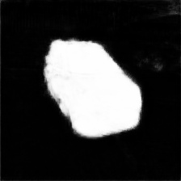

# Car-Segmentation
Car Segmentation

## Approach
Background removal and replacement in car images using UNet based model with vgg16 backbone

## Dataset
The [dataset](https://www.kaggle.com/intelecai/car-segmentation) consists of a total 211 images of which 80% were randomly sampled for training and rest for validation. It can be downloaded from this [link](https://drive.google.com/drive/folders/1loCOd2kj0crBpsyhHzJ6ONZchQnS1-xt?usp=sharing).

## Results
The best IOU score on validation set is 0.94 and F1 score of 0.97

Using the trained model, the segmentation masks were obtained for the provided [test images](data/Testimages/). It takes 800ms per image to create mask.

  

  

  

The trained model can be downloaded from this [link](https://drive.google.com/file/d/1lE_WcXivFuUVng_8nlM8aBssTi4CtRFb/view?usp=sharing).

For running on mobile devices, the model can be quantized and exported to suitable formats such as tflite.

We can expand the training dataset and also aim for bigger models such as ResNet or Inception to further improve the performance.
